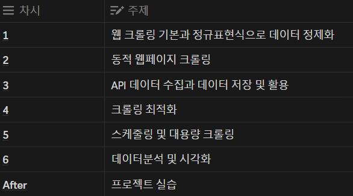

# DataCrawlingStudy
AI와데이터분석 팀의 데이터 크롤링 스터디를 기록한 레포지토리입니다.

## 데이터 크롤링이 나에게 필요한 기술일까?
1. NLP 모델을 활용한 프로젝트에서 모델의 학습 데이터 수집이나 실시간 데이터 수집을 통해서 더 좋은 성능의 모델을 개발할 수 있기에 필요하다.
2. 크롤링 데이터를 통해서 데이터 기반의 API를 구현해서 좋은 서비스를 개발하는 엔지니어로 성장할 수 있다.

___

## 스터디 커리큘럼
공부내용은 README.md 파일에 올리고, 실습 코드는 그대로 레포에 제출.  
실습 방식은 HTML 코드가 주어지고 VSC에서 live server로 포트를 열고 해당 port에서 크롤링을 하는 식으로 진행.
