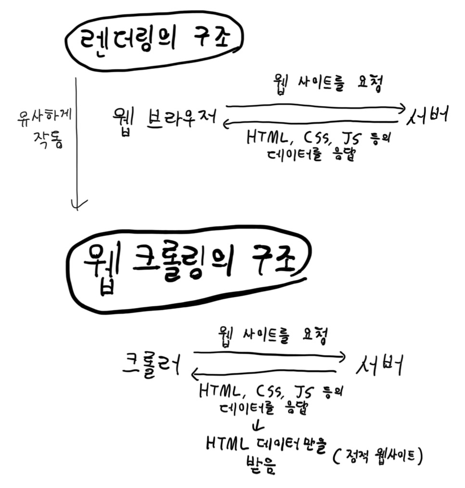
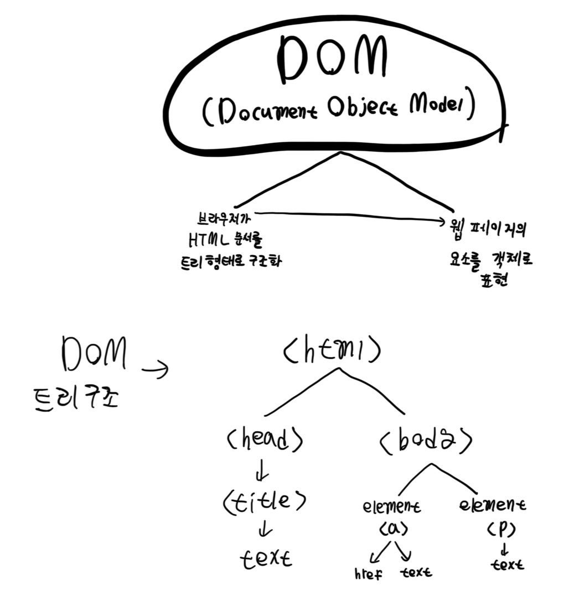

# 웹 크롤링과 정규표현식
[이론](#이론)

[문제](#문제)

___

## 이론
## 웹 크롤링의 구조
 
웹 크롤링은 렌더링과 동일하게 서버로부터 웹 페이지의 데이터를 받아오지만, 크롤러가 HTML만을 받아서
 찾는 HTML에서 찾는 데이터만을 탐색하는 데이터 탐색 기법이다.

 

## HTML의 구조
 
HTML은 DOM tree의 구조를 따른다.  
DOM tree는 html을 루트로 하고, 그 자식 노드는 head, body로 
구성되며 그 밑에는 여러 속성들로 구성된다.   
웹 크롤링은 DOM tree를 탐색하면서 목표하는 데이터를 찾으면서 
진행된다.

 

___

## 문제
### 정적사이트 크롤링
1. 추출해야할 데이터 : 페이지 제목, 헤더 내용, 링크의 url
2. 추출해야할 데이터 : 헤더 내용, id="description"인 문단의 내용, 모든 class="info" 문단의 내용을 리스트로 저장
3. 추출해야할 데이터 : 테이블 헤더 (Product, Price), 각 제품 이름과 가격을 딕셔너리 형태로 저장
4. 추출해야할 데이터 : 각 카테고리 (h2 태그) 이름, 각 카테고리의 리스트 항목 (li 태그)를 분리하여 저장
5. data-category 속성을 기준으로 항목 분리
### 정규표현식으로 데이터 정제화
6. 웹페이지에서 모든 이메일 주소를 추출
7. 웹페이지에서 YYYY-MM-DD 형식의 날짜를 추출
8. 웹페이지에서 모든 전화번호를 추출하세요. 전화번호는 (국가코드)-지역번호-번호 형식
9. 웹페이지에서 URL을 추출하고, 각 URL의 도메인 이름만 추출
10. 웹페이지에서 제품코드: [대문자4자리-숫자3자리] 형식의 제품 코드를 추출
